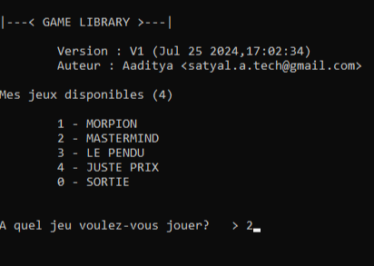
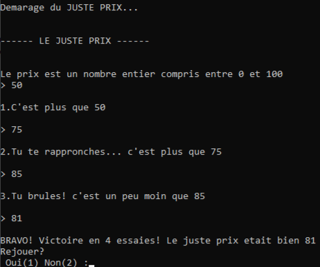

# Game Library
Game Library est un projet réalisé en mars 2024 pendant mon apprentissage du langage C. Entièrement codé en langage C, le projet offre à l’utilisateur l'accès à une bibliothèque de jeux. À son lancement, le programme affiche une interface d'accueil dans le terminal, lui permettant de faire son choix et de jouer à 4 grands classiques.
  
### Interface d'acceuil :


## Jeux disponibles
1 - **Morpion**  
  
  
2 - **Mastermind**  
  
  
3 - **Pendu**   
    
  
4 - **Juste Prix**  
  
  
Chaque jeu est soigneusement conçu pour *gérer tous les scénarios possibles*, y compris les cas de *victoire, de défaite, de mauvaise saisie utilisateur et de match nul* lorsque cela est pertinent. À la fin de chaque partie, le joueur a le choix de *rejouer* ou de *revenir à l'interface d'accueil.*  


## Fonctionnalités

**Interface d'accueil :**
   - Sélection des jeux.
   - Option pour quitter le programme.

**Jeux inclus :**
   - Morpion : Jouez au classique tic-tac-toe.
   - Mastermind : Devinez la combinaison de couleurs.
   - Pendu : Trouvez le mot avant d'être "pendu".
   - Juste Prix : Devinez le prix juste d'un article.

**Gestion des cas de jeu :**
   - Victoire : Reconnaît et annonce la victoire du joueur.
   - Défaite : Gère les scénarios de défaite.
   - Match nul : Reconnaît les situations de match nul (pour les jeux où cela s'applique).
   - Mauvaise saisie utilisateur : Détecte et gère les entrées incorrectes.

     

## Structure du projet
Le projet est organisé de manière modulaire :
- **Fichier principal** (`main.c`) : Ce fichier est le point d'entrée du programme et contient l'interface d'accueil permettant de sélectionner un jeu ou de quitter la bibliothèque.
- **Fichiers sources et headers** : Chaque jeu est encapsulé dans deux fichiers, un fichier source (`.c`) et un fichier header (`.h`). Les fichiers source sont placés dans le dossier `source` et les fichiers header dans le dossier `headers`.

### Exemple de structure des fichiers
```
GameLibrary/
├── source/
│   ├── jeux.c
│   ├── juste_prix.c
│   ├── main.c
│   ├── master_mind.c
│   ├── morpion.c
│   ├── outils.c
│   ├── pendu.c
├── headers/
│   ├── jeux.h
│   ├── juste_prix.h
│   ├── master_mind.h
│   ├── morpion.h
│   ├── outils.h
│   ├── pendu.h
```


## Comment jouer
1. **Cloner le dépôt GitHub** :  
   *Dans un terminal*
   ```bash
   git clone https://github.com/AadiDevv/Game_library.git
   cd Game_library
   ```

3. **Compiler le programme** :
   Utilisez un compilateur C pour compiler le programme. Voici un exemple de compilateur que vous pouvez utiliser :
   - **GCC** (GNU Compiler Collection) :
     ```bash
     gcc -o Game_library source/main.c source/jeux.c source/juste_prix.c source/master_mind.c source/morpion.c source/outils.c source/pendu.c -Iheaders
     ```

   - **Code::Blocks** (utilisez l'interface graphique pour ajouter les fichiers source et les headers, puis compilez le projet).

4. **Lancer le programme** :
   ```bash
   ./GameLibrary
   ```

5. **Suivre les instructions** :
   Une fois le programme lancé, suivez les instructions à l'écran pour choisir un jeu ou quitter la bibliothèque.

## Remerciements
Je vous remercie d'avoir pris le temps de découvrir et d'utiliser GameLibrary.
## Contact

Email : satyal.a.tech@gmail.com

